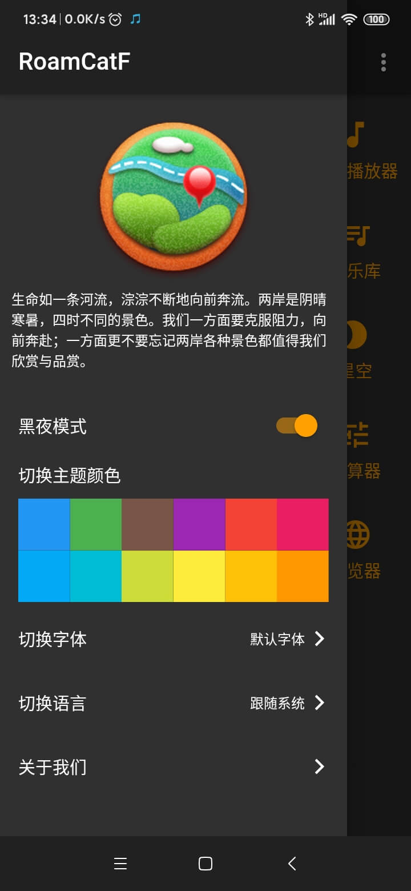

# RoamCatFlutter

[应用预览版下载  Download Preview APP](http://res.ehorizon.top/roamcat/apk-flutter/RoamCatF.apk)

Flutter application of rewrite [RoamCatX](https://github.com/guangGG/RoamCatX) project home page.

[RoamCatX](https://github.com/guangGG/RoamCatX) 应用的Flutter版本(重写了应用的主页皮肤)。

build apk: `flutter build apk`

screenshot home|screenshot menu
:-:|:-:
|

### Flutter Documents
- [Pub Packages 镜像](https://pub.flutter-io.cn/) · [Pub Packages](https://pub.dev/)
- [Flutter中文网](https://flutterchina.club/docs/) · [Flutter Documentation](https://flutter.dev/docs)
- [Dart 语言开发文档](https://dart.cn/guides) · [Dart documentation](https://dart.dev/guides)
- [Flutter GitHub](https://github.com/flutter/flutter) · [Official Plug-in GitHub](https://github.com/flutter/plugins)

Some Flutter Blog:
- [Flutter快速上车之Widget](https://juejin.im/post/5b8ce76f51882542c0626887)
- [Flutter 开发踩坑记录](https://juejin.im/post/5e58ceadf265da575918dd14)
- [深入理解BuildContext](https://juejin.im/post/5c665cb651882562914ec153)
- [深入理解Flutter Platform Channel](https://juejin.im/post/5b84ff6a6fb9a019f47d1cc9)
- [flutter笔记](http://tblog.ehorizon.top/2020/03/09/20200309/)

-- End --

